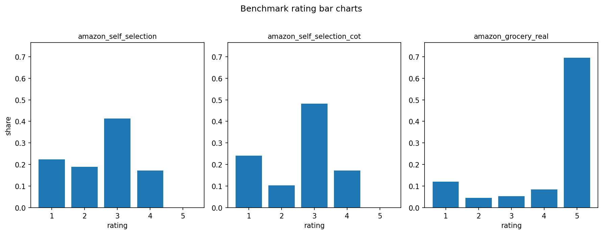

# Benchmark comparison report

Mode: `benchmark`

Outcome field: `rating`

Reference condition: `amazon_grocery_real`

## Per-condition metrics

| label | model | strategy | n_evaluations | n_with_outcome | rating_mean | rating_std | rating_median | rating_entropy | rating_normalized_entropy | panelist_mean_variance | mean_pairwise_panelist_distance | product_mean_variance |
| --- | --- | --- | --- | --- | --- | --- | --- | --- | --- | --- | --- | --- |
| amazon_grocery_real | real | reference | 2921 | 2921 | 4.1890 | 1.4071 | 5.0000 | 1.4641 | 0.6306 | 1.9812 | 0.9793 | 0.2903 |
| amazon_self_selection | gemma3:12b | persona | 58 | 58 | 2.5345 | 1.0207 | 3.0000 | 1.9025 | 0.9513 | 0.2586 | 1.2355 | 0.3642 |
| amazon_self_selection_cot | gemma3:12b | persona_cot | 29 | 29 | 2.5862 | 1.0345 | 3.0000 | 1.7780 | 0.8890 | 0.3287 | 1.0061 | 0.5648 |

## Overall rating bar charts

## Benchmark summary

| reference_label | label | model | strategy | n_reference_products | n_condition_products | n_shared_products | product_overlap_rate_vs_reference | product_jaccard_overlap | n_reference_reviews_on_shared_products | n_condition_reviews_on_shared_products | shared_product_review_js_divergence | shared_product_review_l1_distance | overall_rating_js_divergence | overall_rating_emd | rating_jsd_egalitarian | rating_jsd_utilitarian | rating_emd_egalitarian | rating_emd_utilitarian |
| --- | --- | --- | --- | --- | --- | --- | --- | --- | --- | --- | --- | --- | --- | --- | --- | --- | --- | --- |
| amazon_grocery_real | amazon_self_selection | gemma3:12b | persona | 20 | 11 | 11 | 0.5500 | 0.5500 | 1807 | 58 | 0.2205 | 0.9639 | 0.5572 | 1.8086 | 0.7728 | 0.7607 | 1.7698 | 1.8936 |
| amazon_grocery_real | amazon_self_selection_cot | gemma3:12b | persona_cot | 20 | 7 | 7 | 0.3500 | 0.3500 | 979 | 29 | 0.0570 | 0.4299 | 0.5855 | 1.8489 | 0.7825 | 0.7201 | 1.7996 | 1.8708 |

## rating_mean (model x strategy)

| model | persona | persona_cot |
| --- | --- | --- |
| gemma3:12b | 2.5345 | 2.5862 |

## rating_std (model x strategy)

| model | persona | persona_cot |
| --- | --- | --- |
| gemma3:12b | 1.0207 | 1.0345 |

## panelist_mean_variance (model x strategy)

| model | persona | persona_cot |
| --- | --- | --- |
| gemma3:12b | 0.2586 | 0.3287 |

## mean_pairwise_panelist_distance (model x strategy)

| model | persona | persona_cot |
| --- | --- | --- |
| gemma3:12b | 1.2355 | 1.0061 |

## product_mean_variance (model x strategy)

| model | persona | persona_cot |
| --- | --- | --- |
| gemma3:12b | 0.3642 | 0.5648 |

## rating_normalized_entropy (model x strategy)

| model | persona | persona_cot |
| --- | --- | --- |
| gemma3:12b | 0.9513 | 0.8890 |

## Product diagnostics (best/worst K by EMD)

| reference_label | label | model | strategy | product_id | n_reference_reviews | n_condition_reviews | product_js_divergence | product_emd | reference_mean_rating | condition_mean_rating | diagnostic_bucket |
| --- | --- | --- | --- | --- | --- | --- | --- | --- | --- | --- | --- |
| amazon_grocery_real | amazon_self_selection | gemma3:12b | persona | B079SPCB8S | 108 | 1 | 0.8238 | 1.0833 | 4.4352 | 4.0000 | best_by_emd |
| amazon_grocery_real | amazon_self_selection | gemma3:12b | persona | B00NVGKH62 | 117 | 5 | 0.7894 | 1.2889 | 4.7692 | 3.6000 | best_by_emd |
| amazon_grocery_real | amazon_self_selection | gemma3:12b | persona | B005XB5WEU | 105 | 11 | 0.8018 | 1.6528 | 4.4667 | 2.9091 | best_by_emd |
| amazon_grocery_real | amazon_self_selection | gemma3:12b | persona | B003Y01F2U | 98 | 13 | 0.4244 | 1.7708 | 3.6939 | 1.9231 | best_by_emd |
| amazon_grocery_real | amazon_self_selection | gemma3:12b | persona | B07LHG659X | 200 | 1 | 0.8550 | 1.7750 | 4.3550 | 3.0000 | best_by_emd |
| amazon_grocery_real | amazon_self_selection | gemma3:12b | persona | B00L28TWOE | 51 | 1 | 0.9301 | 1.7843 | 4.4314 | 3.0000 | best_by_emd |
| amazon_grocery_real | amazon_self_selection | gemma3:12b | persona | B003NCECVU | 63 | 1 | 0.8603 | 1.8254 | 4.7619 | 3.0000 | best_by_emd |
| amazon_grocery_real | amazon_self_selection | gemma3:12b | persona | B07D83RPTD | 234 | 1 | 0.7687 | 1.9487 | 3.4188 | 2.0000 | best_by_emd |
| amazon_grocery_real | amazon_self_selection | gemma3:12b | persona | B07R7G67V9 | 321 | 17 | 0.5279 | 2.0081 | 4.3022 | 2.2941 | best_by_emd |
| amazon_grocery_real | amazon_self_selection | gemma3:12b | persona | B00DDJY8HQ | 77 | 5 | 0.8401 | 2.0494 | 4.6494 | 2.6000 | best_by_emd |
| amazon_grocery_real | amazon_self_selection | gemma3:12b | persona | B0BS74PNH7 | 433 | 2 | 0.8795 | 2.2806 | 4.7206 | 2.5000 | best_by_emd |
| amazon_grocery_real | amazon_self_selection | gemma3:12b | persona | B0BS74PNH7 | 433 | 2 | 0.8795 | 2.2806 | 4.7206 | 2.5000 | worst_by_emd |
| amazon_grocery_real | amazon_self_selection | gemma3:12b | persona | B00DDJY8HQ | 77 | 5 | 0.8401 | 2.0494 | 4.6494 | 2.6000 | worst_by_emd |
| amazon_grocery_real | amazon_self_selection | gemma3:12b | persona | B07R7G67V9 | 321 | 17 | 0.5279 | 2.0081 | 4.3022 | 2.2941 | worst_by_emd |
| amazon_grocery_real | amazon_self_selection | gemma3:12b | persona | B07D83RPTD | 234 | 1 | 0.7687 | 1.9487 | 3.4188 | 2.0000 | worst_by_emd |
| amazon_grocery_real | amazon_self_selection | gemma3:12b | persona | B003NCECVU | 63 | 1 | 0.8603 | 1.8254 | 4.7619 | 3.0000 | worst_by_emd |
| amazon_grocery_real | amazon_self_selection | gemma3:12b | persona | B00L28TWOE | 51 | 1 | 0.9301 | 1.7843 | 4.4314 | 3.0000 | worst_by_emd |
| amazon_grocery_real | amazon_self_selection | gemma3:12b | persona | B07LHG659X | 200 | 1 | 0.8550 | 1.7750 | 4.3550 | 3.0000 | worst_by_emd |
| amazon_grocery_real | amazon_self_selection | gemma3:12b | persona | B003Y01F2U | 98 | 13 | 0.4244 | 1.7708 | 3.6939 | 1.9231 | worst_by_emd |
| amazon_grocery_real | amazon_self_selection | gemma3:12b | persona | B005XB5WEU | 105 | 11 | 0.8018 | 1.6528 | 4.4667 | 2.9091 | worst_by_emd |
| amazon_grocery_real | amazon_self_selection | gemma3:12b | persona | B00NVGKH62 | 117 | 5 | 0.7894 | 1.2889 | 4.7692 | 3.6000 | worst_by_emd |
| amazon_grocery_real | amazon_self_selection | gemma3:12b | persona | B079SPCB8S | 108 | 1 | 0.8238 | 1.0833 | 4.4352 | 4.0000 | worst_by_emd |
| amazon_grocery_real | amazon_self_selection_cot | gemma3:12b | persona_cot | B079SPCB8S | 108 | 1 | 0.8238 | 1.0833 | 4.4352 | 4.0000 | best_by_emd |
| amazon_grocery_real | amazon_self_selection_cot | gemma3:12b | persona_cot | B07LHG659X | 200 | 2 | 0.7185 | 1.2750 | 4.3550 | 3.5000 | best_by_emd |
| amazon_grocery_real | amazon_self_selection_cot | gemma3:12b | persona_cot | B00NVGKH62 | 117 | 6 | 0.8101 | 1.5556 | 4.7692 | 3.3333 | best_by_emd |
| amazon_grocery_real | amazon_self_selection_cot | gemma3:12b | persona_cot | B005XB5WEU | 105 | 3 | 0.8201 | 1.6762 | 4.4667 | 3.0000 | best_by_emd |
| amazon_grocery_real | amazon_self_selection_cot | gemma3:12b | persona_cot | B00DDJY8HQ | 77 | 4 | 0.9126 | 1.8831 | 4.6494 | 3.0000 | best_by_emd |
| amazon_grocery_real | amazon_self_selection_cot | gemma3:12b | persona_cot | B00L28TWOE | 51 | 2 | 0.8361 | 2.5490 | 4.4314 | 2.0000 | best_by_emd |
| amazon_grocery_real | amazon_self_selection_cot | gemma3:12b | persona_cot | B07R7G67V9 | 321 | 11 | 0.5559 | 2.5749 | 4.3022 | 1.7273 | best_by_emd |
| amazon_grocery_real | amazon_self_selection_cot | gemma3:12b | persona_cot | B07R7G67V9 | 321 | 11 | 0.5559 | 2.5749 | 4.3022 | 1.7273 | worst_by_emd |
| amazon_grocery_real | amazon_self_selection_cot | gemma3:12b | persona_cot | B00L28TWOE | 51 | 2 | 0.8361 | 2.5490 | 4.4314 | 2.0000 | worst_by_emd |
| amazon_grocery_real | amazon_self_selection_cot | gemma3:12b | persona_cot | B00DDJY8HQ | 77 | 4 | 0.9126 | 1.8831 | 4.6494 | 3.0000 | worst_by_emd |
| amazon_grocery_real | amazon_self_selection_cot | gemma3:12b | persona_cot | B005XB5WEU | 105 | 3 | 0.8201 | 1.6762 | 4.4667 | 3.0000 | worst_by_emd |
| amazon_grocery_real | amazon_self_selection_cot | gemma3:12b | persona_cot | B00NVGKH62 | 117 | 6 | 0.8101 | 1.5556 | 4.7692 | 3.3333 | worst_by_emd |
| amazon_grocery_real | amazon_self_selection_cot | gemma3:12b | persona_cot | B07LHG659X | 200 | 2 | 0.7185 | 1.2750 | 4.3550 | 3.5000 | worst_by_emd |
| amazon_grocery_real | amazon_self_selection_cot | gemma3:12b | persona_cot | B079SPCB8S | 108 | 1 | 0.8238 | 1.0833 | 4.4352 | 4.0000 | worst_by_emd |
