# Analysis report: run_beer_demo_questionnaire

## Run overview

|  |   |
| --- | --- |
| Run name | run_beer_demo_questionnaire |
| Policy | self_selection |
| Schema version | 0.1.0 |
| Seed | 101 |
| Generated at (UTC) | 2026-03-16T09:33:45+00:00 |
| Backend | ollama |
| Model | gemma3:12b |
| Outcomes model | llm |
| Outcomes temperature | 0.2000 |

|  |   |
| --- | --- |
| Events | 80 |
| Evaluation rows | 60 |
| Selection rows | 20 |
| Unique panelists | 20 |
| Unique products | 9 |
| Periods | 1 |

## Quality metrics

|  |   |
| --- | --- |
| Outcome coverage rate | 1.0000 |
| Trace coverage rate | 1.0000 |
| Panelist feature coverage | 1.0000 |
| Product feature coverage | 1.0000 |
| Selection link rate | 1.0000 |

## Outcome summary

| field | type | n | missing | mean | min | max | n_unique |
| --- | --- | --- | --- | --- | --- | --- | --- |
| bitterness | int | 60 | 0 | 2.6500 | 2 | 4 |  |
| drinking_habit | categorical | 60 | 0 |  |  |  | 2 |
| purchase_intent | categorical | 60 | 0 |  |  |  | 3 |
| rating | int | 60 | 0 | 2.7833 | 1 | 4 |  |
| usefulness | categorical | 60 | 0 |  |  |  | 1 |

## Outcome diversity

`norm_entropy` is relative to the declared support. `observed`/`declared` show how many distinct values appeared vs. how many the questionnaire allows.

| field | entropy | norm_entropy | observed | declared |
| --- | --- | --- | --- | --- |
| bitterness | 1.4248 | 0.6136 | 3 | 5 |
| drinking_habit | 0.4138 | 0.4138 | 2 | 2 |
| purchase_intent | 1.3177 | 0.8314 | 3 | 3 |
| rating | 1.7760 | 0.7649 | 4 | 5 |
| usefulness | 0.0000 | 0.0000 | 1 | 2 |

## Panelist/product differentiation

Outcome field: `rating`

|  |   |
| --- | --- |
| Overall variance | 0.8031 |
| Variance of panelist means | 0.3253 |
| Variance of product means | 0.3286 |
| Mean within-product panelist variance | 0.4962 |
| Mean within-panelist product variance | 0.4778 |
| Mean pairwise panelist distance | 0.8299 |
| Mean pairwise product distance | 0.9389 |

## Selection behavior

|  |   |
| --- | --- |
| Selection events | 20 |
| Avg choice set size | 10.0000 |
| Avg requested | 4.2500 |
| Avg executed | 3.0000 |
| Avg dropped | 1.2500 |
| Empty request rate | 0.0000 |
| Empty execution rate | 0.0000 |
| Request-to-execution ratio | 0.7059 |
| Drop rate | 0.2941 |

|  |   |
| --- | --- |
| Requested entropy | 3.0248 |
| Requested norm entropy (full) | 0.9106 |
| Executed entropy | 2.8462 |
| Executed norm entropy (full) | 0.8568 |
| Unique requested products | 10 |
| Unique executed products | 9 |

## Regression analysis

Models fitted: 4

> Caution: coefficient estimates can be useful diagnostically, but standard errors, p-values, and confidence intervals should be interpreted carefully in small synthetic runs with grouped observations.

> Significance markers: `*` p < 0.10, `**` p < 0.05, `***` p < 0.01.

### ordered_logit / panelist_features / rating

|  |   |
| --- | --- |
| N | 60 |
| Features | 19 |
| Covariance | cluster |
| Panelist clusters | 20 |
| Product clusters | 9 |
| AIC | 159.3287 |
| BIC | 205.4043 |
| Log-lik | -57.6644 |
Dropped columns: 5 (constant: 0, duplicate: 1, rank-deficient: 4)

Attribute coefficients

| term | estimate | std_error | p_value | ci_low | ci_high |
| --- | --- | --- | --- | --- | --- |
| panelist.beer_style_affinity.stout | 5.7988*** | 1.3853 | 0.0000 | 3.0837 | 8.5140 |
| panelist.age_group_30-39 | 5.9269*** | 1.5668 | 0.0002 | 2.8561 | 8.9977 |
| panelist.beer_style_affinity.ipa | 35.9998*** | 10.7495 | 0.0008 | 14.9312 | 57.0683 |
| panelist.beer_style_affinity.lager | 34.1308*** | 10.8961 | 0.0017 | 12.7748 | 55.4868 |
| panelist.gender_male | 5.5816*** | 1.9495 | 0.0042 | 1.7607 | 9.4026 |
| panelist.beer_style_affinity.wheat | 11.1169*** | 4.1295 | 0.0071 | 3.0232 | 19.2107 |
| panelist.bitterness_tolerance | -8.5696*** | 3.3252 | 0.0100 | -15.0868 | -2.0524 |
| panelist.age_group_40-49 | 13.6125** | 6.9211 | 0.0492 | 0.0473 | 27.1776 |
| panelist.abv_preference | 4.7544* | 2.8112 | 0.0908 | -0.7555 | 10.2644 |
| panelist.age_group_65+ | 16.3418 | 11.9204 | 0.1704 | -7.0218 | 39.7053 |
| panelist.beer_style_affinity.sour | 5.9918 | 4.4122 | 0.1745 | -2.6560 | 14.6396 |
| panelist.region_Northeast | -4.8313 | 4.1569 | 0.2451 | -12.9786 | 3.3160 |

Dropped columns

| column | reason |
| --- | --- |
| panelist.income_bracket_30-60k | duplicate |
| panelist.income_bracket_60-100k | rank_deficient |
| panelist.income_bracket_<30k | rank_deficient |
| panelist.region_South | rank_deficient |
| panelist.region_West | rank_deficient |

Artifacts:
- `coefficients_attributes_csv`: `regression/00_ordered_logit_panelist_features_rating_coefficients_attributes.csv`
- `coefficients_full_csv`: `regression/00_ordered_logit_panelist_features_rating_coefficients_full.csv`
- `coefficients_top_attributes_csv`: `regression/00_ordered_logit_panelist_features_rating_coefficients_top_attributes.csv`
- `dropped_columns_csv`: `regression/00_ordered_logit_panelist_features_rating_dropped_columns.csv`
- `metadata_json`: `regression/00_ordered_logit_panelist_features_rating_metadata.json`
- `summary_json`: `regression/00_ordered_logit_panelist_features_rating_summary.json`

### ordered_probit / panelist_features / rating

|  |   |
| --- | --- |
| N | 60 |
| Features | 19 |
| Covariance | cluster |
| Panelist clusters | 20 |
| Product clusters | 9 |
| AIC | 157.9636 |
| BIC | 204.0392 |
| Log-lik | -56.9818 |
Dropped columns: 5 (constant: 0, duplicate: 1, rank-deficient: 4)

Attribute coefficients

| term | estimate | std_error | p_value | ci_low | ci_high |
| --- | --- | --- | --- | --- | --- |
| panelist.beer_style_affinity.stout | 3.3273*** | 0.4724 | 0.0000 | 2.4015 | 4.2531 |
| panelist.bitterness_tolerance | -5.5268*** | 0.8770 | 0.0000 | -7.2457 | -3.8079 |
| panelist.abv_preference | 6.4728*** | 1.4716 | 0.0000 | 3.5885 | 9.3571 |
| panelist.gender_male | 3.5388*** | 0.8512 | 0.0000 | 1.8703 | 5.2072 |
| panelist.age_group_30-39 | 4.8023*** | 1.4776 | 0.0012 | 1.9063 | 7.6984 |
| panelist.beer_style_affinity.lager | 30.3868*** | 9.5056 | 0.0014 | 11.7562 | 49.0175 |
| panelist.age_group_40-49 | 17.6060*** | 6.2138 | 0.0046 | 5.4273 | 29.7848 |
| panelist.beer_style_affinity.ipa | 35.1391*** | 12.6826 | 0.0056 | 10.2816 | 59.9966 |
| panelist.age_group_65+ | 31.6092*** | 12.1593 | 0.0093 | 7.7773 | 55.4411 |
| panelist.beer_style_affinity.sour | 12.4418*** | 4.8153 | 0.0098 | 3.0041 | 21.8796 |
| panelist.region_Northeast | -9.4493** | 3.7172 | 0.0110 | -16.7348 | -2.1637 |
| panelist.age_group_50-64 | 55.3878** | 22.3085 | 0.0130 | 11.6640 | 99.1116 |

Dropped columns

| column | reason |
| --- | --- |
| panelist.income_bracket_30-60k | duplicate |
| panelist.income_bracket_60-100k | rank_deficient |
| panelist.income_bracket_<30k | rank_deficient |
| panelist.region_South | rank_deficient |
| panelist.region_West | rank_deficient |

Artifacts:
- `coefficients_attributes_csv`: `regression/01_ordered_probit_panelist_features_rating_coefficients_attributes.csv`
- `coefficients_full_csv`: `regression/01_ordered_probit_panelist_features_rating_coefficients_full.csv`
- `coefficients_top_attributes_csv`: `regression/01_ordered_probit_panelist_features_rating_coefficients_top_attributes.csv`
- `dropped_columns_csv`: `regression/01_ordered_probit_panelist_features_rating_dropped_columns.csv`
- `metadata_json`: `regression/01_ordered_probit_panelist_features_rating_metadata.json`
- `summary_json`: `regression/01_ordered_probit_panelist_features_rating_summary.json`

### probit / panelist_features / usefulness

**Skipped**: binary target 'usefulness' has only one class present; logit/probit requires observations in both classes

### logit / panelist_features / usefulness

**Skipped**: binary target 'usefulness' has only one class present; logit/probit requires observations in both classes

## Plots

### Outcome distributions

Empirical distribution of each declared outcome field across evaluation rows.

<table>
<tr>
<td>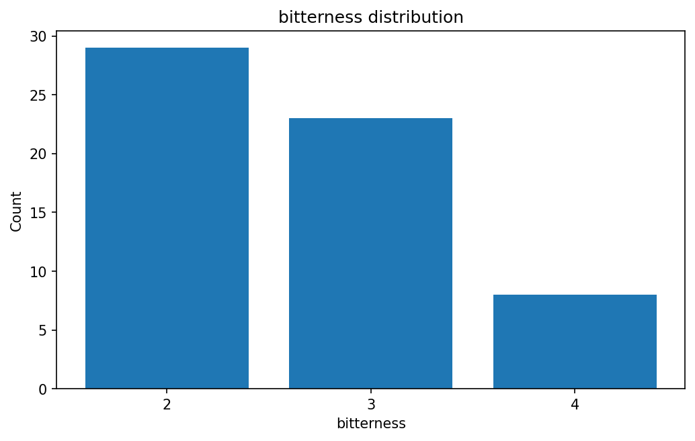 outcome_distribution_bitterness_count</td>
<td>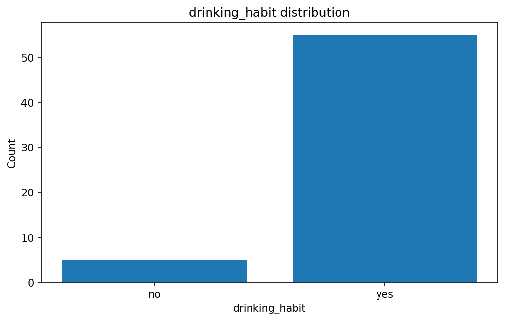 outcome_distribution_drinking_habit_count</td>
<td>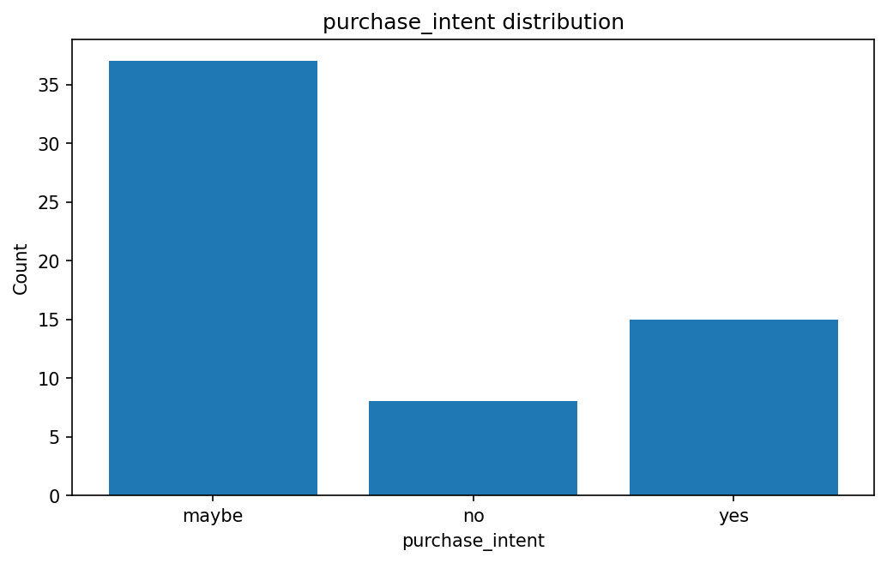 outcome_distribution_purchase_intent_count</td>
</tr>
<tr>
<td>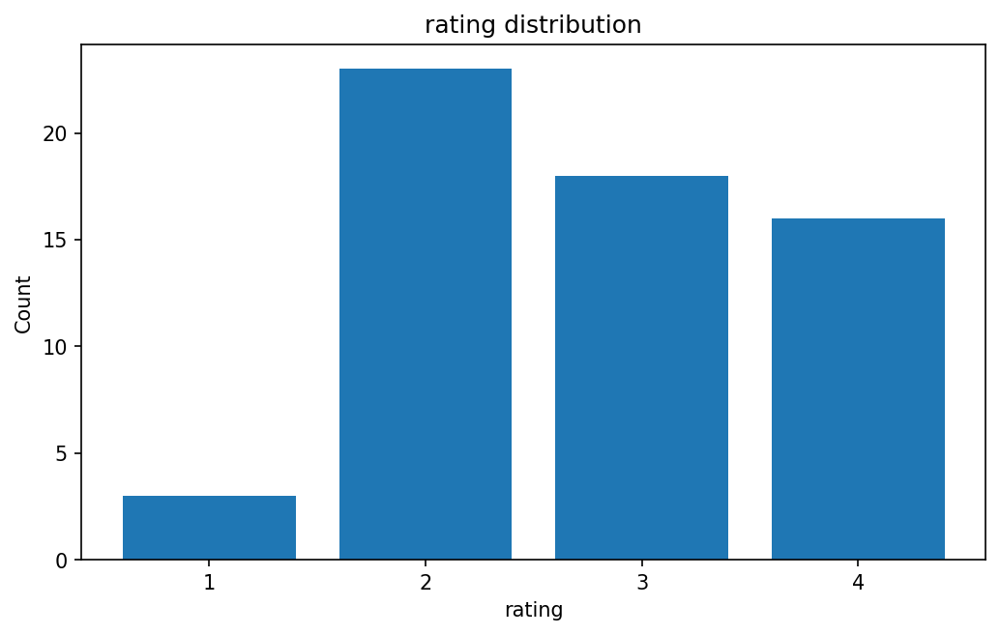 outcome_distribution_rating_count</td>
<td>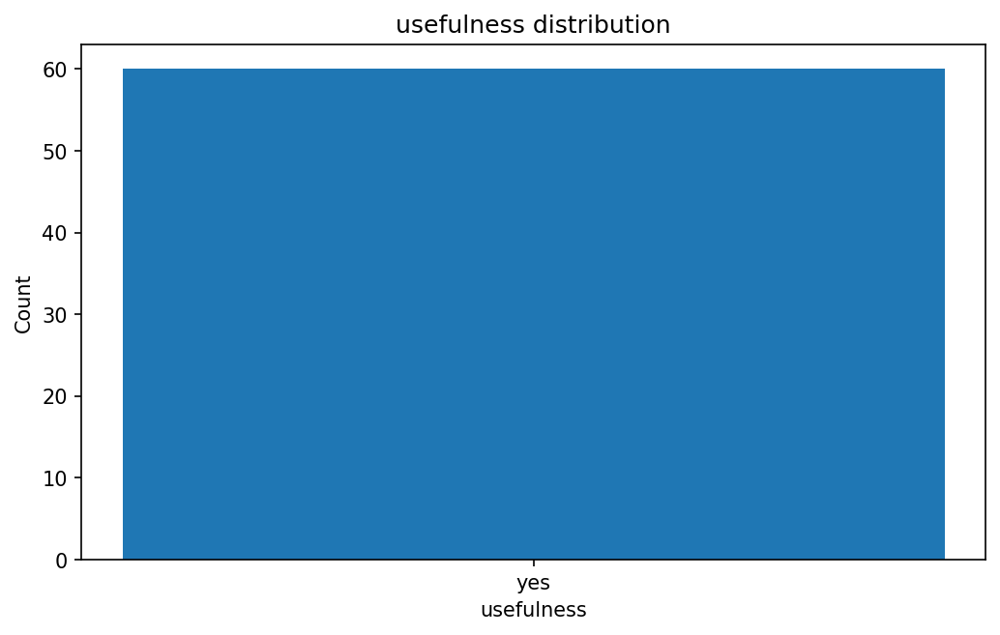 outcome_distribution_usefulness_count</td>
</tr>
</table>

### Panelist summaries

Per-panelist summary statistics for the selected outcome field.

<table>
<tr>
<td>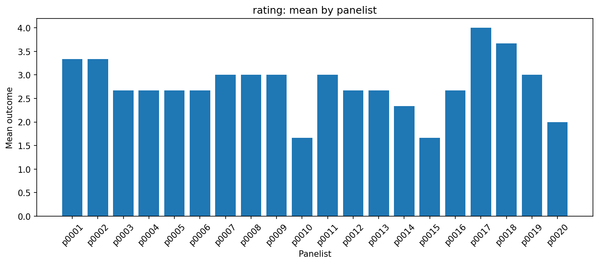 panelist_mean_rating</td>
<td>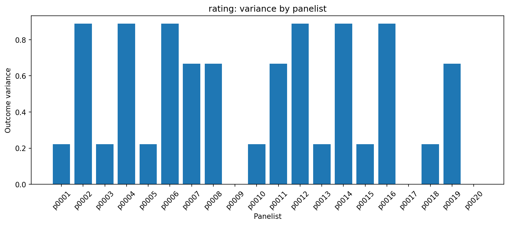 panelist_variance_rating</td>
</tr>
</table>

### Product summaries

Per-product summary statistics for the selected outcome field.

<table>
<tr>
<td>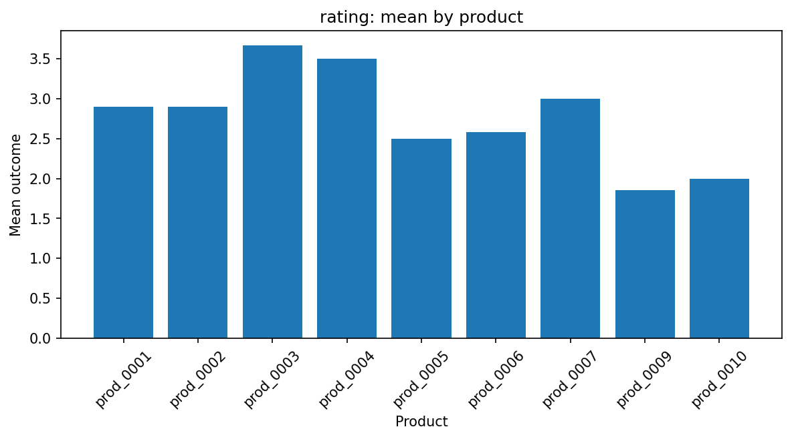 product_mean_rating</td>
<td>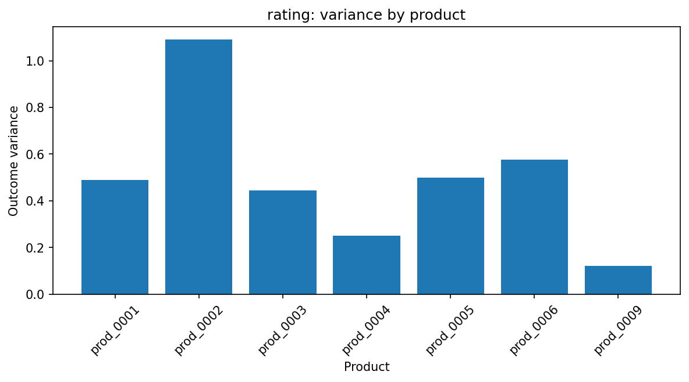 product_variance_rating</td>
</tr>
</table>

### Selection concentration

How selection mass is distributed across products in self-selection runs.

<table>
<tr>
<td>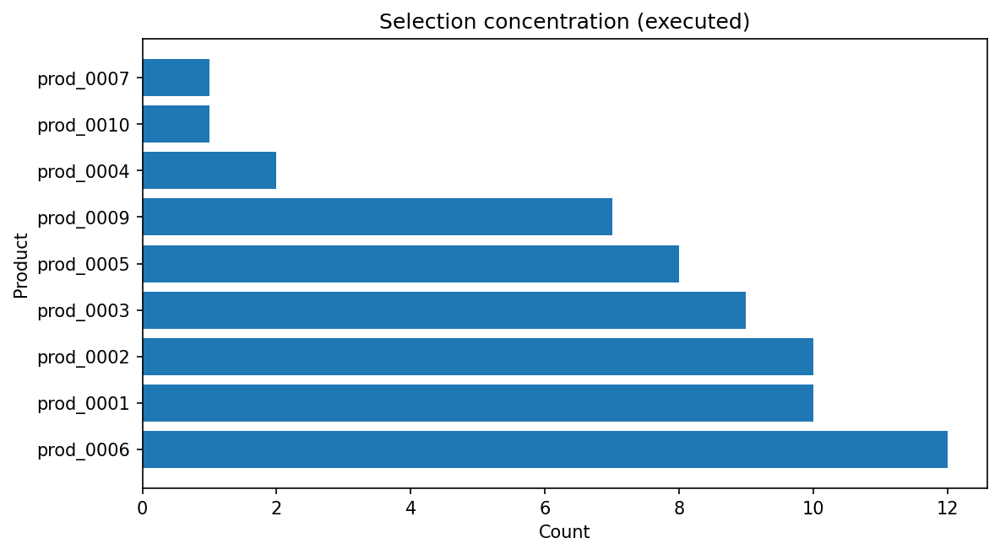 selection_concentration_executed</td>
<td>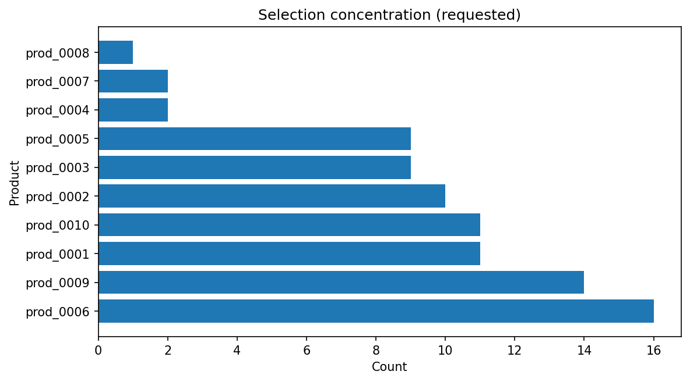 selection_concentration_requested</td>
</tr>
</table>

## Notes

- Detailed machine-readable artifacts are saved under `summary/`, `metrics/`, `plots/`, and `regression/`.
- This report is intended as a lightweight overview; see JSON/CSV outputs for full data.
